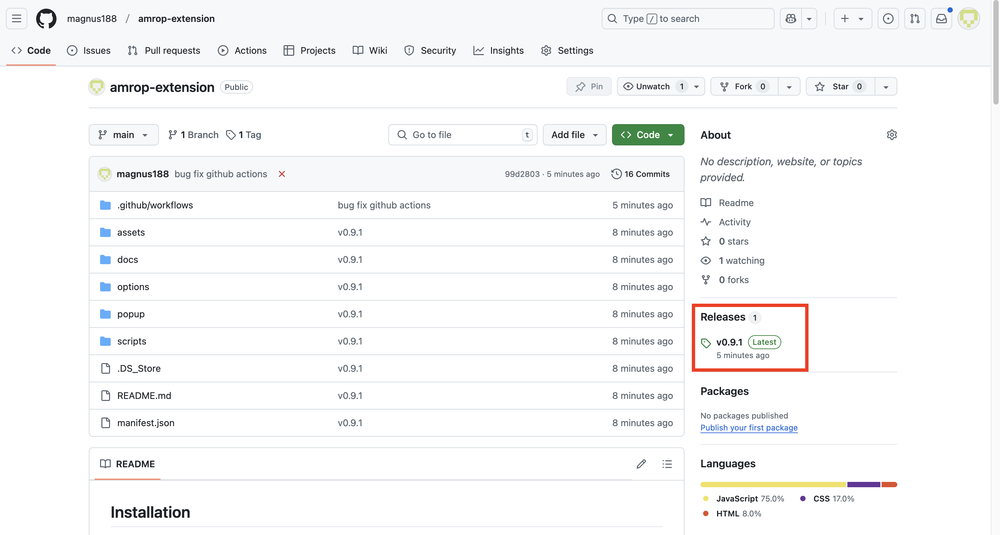
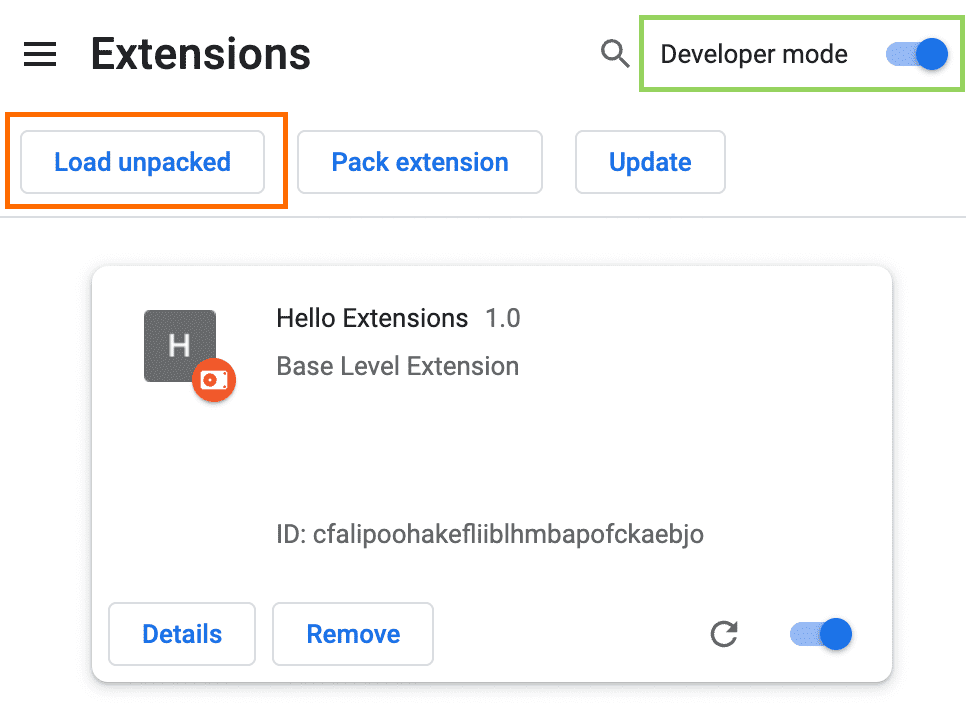
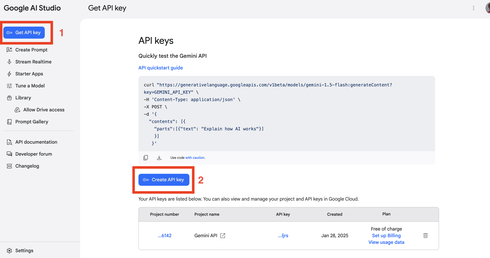
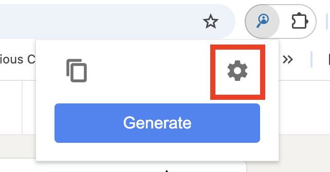
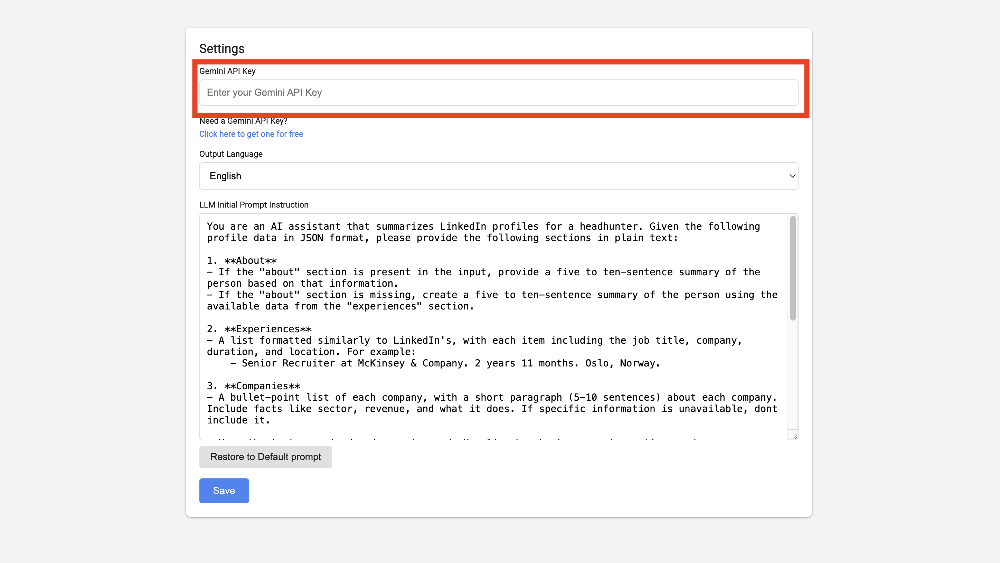
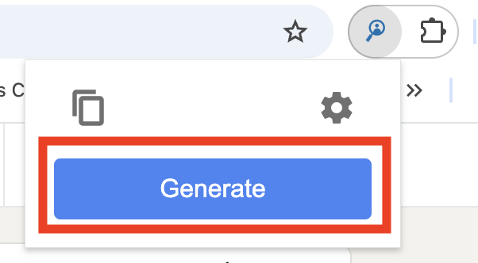
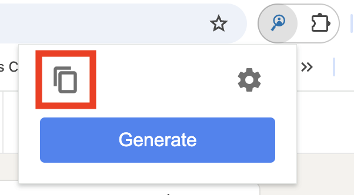

# Documentation Amrop listeprepp generator 


## Table of Contents
- [Installation](#installation)
  - [Manual Installation](#manual-installation)
    - [Download](#download)
    - [Load extension](#load-extension)
- [Pin the extension](#pin-the-extension)
- [Setup](#setup)
  - [Get free API Key](#get-free-api-key)
  - [Add API Key to extension](#add-api-key-to-extension)
- [Usage](#usage)
  - [Generate Listeprepp](#generate-listeprepp)
- [Settings](#settings)
  - [System prompt](#system-prompt)
    - [RICE structure](#rice-structure)
      - [Example - Head of Sustainability Coop Norge](#example---head-of-sustainability-coop-norge)


## Installation

The chrome extension can be installed in two ways:

1. Via the Chrome Store (⚠️ Currently Unavailable ⚠️)
2. Manual installation

### Manual Installation

#### Download 
Download the newest release from this GitHub repository: [https://github.com/magnus188/amrop-extension/releases](https://github.com/magnus188/amrop-extension/releases)

Releases can also be found on the main repository page: [https://github.com/magnus188/amrop-extension](https://github.com/magnus188/amrop-extension)



#### Load extension

1. Open Google Chrome
2. Go to the Extensions page by entering `chrome://extensions` in a new tab.
	- Alternatively, click the Extensions menu puzzle button and select **Manage Extensions** at the bottom of the menu.
	- Or, click the Chrome menu, hover over **More Tools,** then select **Extensions**.
3. Enable Developer Mode by clicking the toggle switch next to **Developer mode**.
4. Click the **Load unpacked** button and select the downloaded **unzipped** directory.



## Pin the extension

By default, when you load your extension locally, it will appear in the extensions menu. Pin your extension to the toolbar to quickly access your extension.


## Setup

### Get free API Key

1. Go to [https://aistudio.google.com/app/apikey](https://aistudio.google.com/app/apikey) to retrieve your free Gemini Api Key.

2. Sign in using your Google Account
3. Create a new API Key
4. Copy the key and keep for next step



### Add API Key to extension

1. Access Settings page of extension



2. Paste in your API Key and click save!




## Usage

### Generate Listeprepp

⚠️⚠️ **NOTE:** As of `v0.9.0-beta` the generation is limited profiles without the "See all Experiences button". This will be enabled in future version.

1. Go to a LinkedIn profile

   
2. Click "Generate"
   

   
3. Listeprepp is now generated and copied to your clipboard!
	- NOTE: To re-copy last generation to clipboard, press copy button.
   


## Settings

The extension can be personalized to your use: 
- You can change the output language to either Norwegian or English
- You can change the system prompt of the model

### System prompt

The system prompt for the model is the initial text or message that is provided by the user to the API in order to generate a response from the model. The system prompt can be thought of as the input or query that the model uses to generate its response. The quality and specificity of the system prompt can have a significant impact on the relevance and accuracy of the model's response. Therefore, it is important to provide a clear and concise system prompt that accurately conveys the user's intended message or question.

#### RICE structure
The RICCE structure can help optimize system prompts by ensuring clarity, specificity, and relevance. **Role**, **Instruction**, **Context**, **Constraints**, and **Example** provide a structured approach to crafting effective prompts that guide the model toward generating accurate and meaningful responses. By defining the AI’s function, specifying the task, providing relevant background, setting limitations, and including reference examples, RICCE enhances the precision and coherence of system prompts. This structured design minimizes ambiguity and maximizes the model’s ability to understand and fulfill the user’s intent, ultimately improving the quality of generated responses.

The default system prompt for the extension follows RICCE principle:

```
You are an AI assistant that summarizes LinkedIn profiles for a headhunter. Given the following profile data in JSON format, please provide the following sections in plain text:

1. **About**
- If the "about" section is present in the input, provide a five to ten-sentence summary of the person based on that information.
- If the "about" section is missing, create a five to ten-sentence summary of the person using the available data from the "experiences" section.

2. **Experiences**
- A list formatted similarly to LinkedIn's, with each item including the job title, company, duration, and location. For example:
    - Senior Recruiter at McKinsey & Company. 2 years 11 months. Oslo, Norway.

3. **Companies**
- A bullet-point list of each company, with a short paragraph (5-10 sentences) about each company. Include facts like sector, revenue, and what it does. If specific information is unavailable, dont include it.

**Keep the text organized and easy to read. Use line breaks to separate sections and ensure clarity. Keep the language strictly informative. Do not include rich text or markdown; only provide raw text following this exact structure:**

About
[A short summary here]

Experiences
- [Experience 1]
- [Experience 2]
- ...

Companies
- [Company 1 overview]
- [Company 2 overview]
- ...

Input:
```
